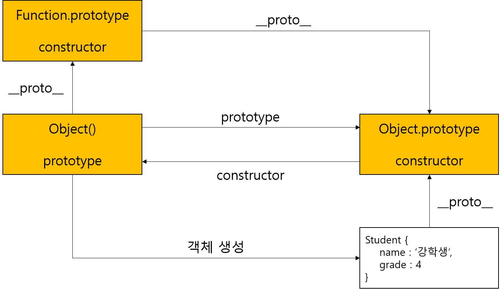
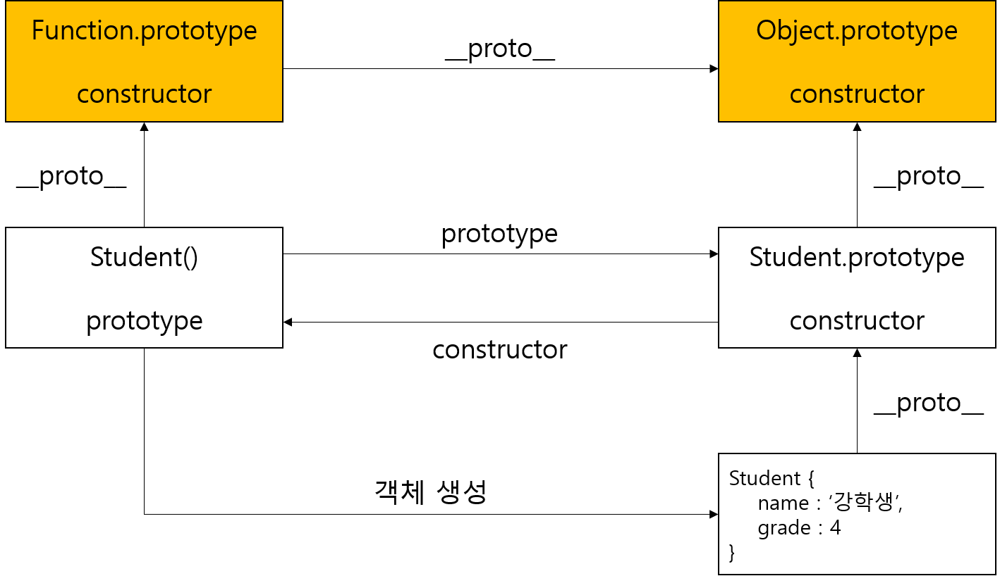

# Prototype Object(`__proto__`)

> - 생각보다 많이 햇깔리고 약간 어렵기 때문에 여러 번 읽어 보는 것을 권장합니다.
> - 추가로 Prototype 프로퍼티와 `[[Prototype]]` 의 혼돈을 막기 위해 각각 `prototype`(혹은 프로토타입) 프로퍼티, `__proto__`(오직 이거로만. 프로토타입 객체.) 로 설명 하겠습니다.

대부분 객체 지향 프로그래밍 언어는 클래스 기반 입니다. 그렇지만 JavaScript 는 Prototype 기반 객체 지향 언어 입니다. 

클래스 기반 객체지향 언어는 객체 생성 **이전**에 클래스를 생성하고 인스턴스를 생성합니다. (물론 JavaScript ES6 버전에서도 클래스 기반 객체지향을 적용할 수 있습니다.)

반대로 JavaScript 의 모든 객체는 자신의 부모 역할을 담당하는 객체와 연결이 되어 있습니다. 이를 이용해서 부모 객체의 프로퍼티, 메소드를 상속받을 수 있게 하는데 이를 Prototype 객체로 부릅니다.

이는 생성자 함수에 의해 생성된 각 객체에 공유 프로퍼티를 제공하기 위해 사용합니다.

```javascript
var person = {
    name : '강학생',
    address : '수원'
};

console.dir(person); // 객체 구성과 Prototype 객체가 함께 나옵니다.
console.log(person.hasOwnProperty('name')); // 이는 Prototype 객체 함수라서 자식 객체인 person 에서도 작동할 수 있습니다.
```

ECMAScript 에서는 JavaScript 모든 객체는 자신의 프로토타입을 가리키는 숨겨진 프로퍼티를 가짐을 명시하고 있습니다. 이 숨겨진 Prototype 프로퍼티는 Chrome V8 엔진을 기준으로 `__proto__` 에 있습니다.

이로서 `person` 객체의 `__proto__` 는 프로퍼티로 자신의 부모 객체인 `Object.prototype` 을 가리킵니다.

또한 JavaScript 에서는 객체를 생성할 때 프로토타입은 결정이 되고, 이를 다른 임의의 객체로 변경할 수 있습니다. 이로서 JavaScript 에서 특정 객체의 상속을 구현할 수 있습니다.

## `__proto__` vs Prototype Property

`__proto__` 프로퍼티는 자신의 부모 역할을 하는 프로토타입 객체를 가리키는 숨겨진 프로퍼티 입니다.

`prototype` 프로퍼티는 함수 객체만 가지고 있는 프로퍼티로, 함수 객체가 생성자로 사용될 때 이 함수로 생성될 객체의 부모 역할을 하는 객체를 가리킵니다.

우리는 함수도 객체인 사실은 이미 알고 있습니다. 허나 일반 객체와는 달리 `prototype` 프로퍼티를 추가로 소유합니다. 참고로 함수도 `__proto__` 프로퍼티도 있습니다. 이는 `Function.prototype` 과 같습니다.

이제 좀 짐작이 가겠지만, 함수에서의 `prototype` 프로퍼티는 함수로 생성된 객체의 `__proto__` 프로퍼티로 가리키게 됩니다. 즉 부모의 `prototype` 프로퍼티는 자식의 `__proto__` 에 영향을 줍니다.

참고로 아래 문장에서 `__proto__` 프로퍼티와 `prototype` 프로퍼티의 차이를 알아보기 위해 작성하였습니다.

```javascript
function Person(name, address){
    this.name = name;
    this.address = address;
}

var person = new Person('강학생', '수원');

console.dir(Person); // prototype 프로퍼티와 __proto__ 프로퍼티가 있습니다.
console.dir(person); // __proto__ 프로퍼티만 있습니다. 이는 부모 객체가 Person 이 됩니다.

// __proto__ Property
console.log(Person.__proto__ === Function.prototype); // true

// Prototype Property
console.log(Person.prototype === person.__proto__); // true
```
 
## Constructor Property

모든 프로토타입 객체(`__proto__`)는 constructor 프로퍼티를 항상 가집니다. 이는 객체의 입장에서 자신을 생성한 객체를 가리킵니다.

```javascript
function Student(name, grade){
    this.name = name;
    this.grade = grade;
}

var std1 = new Student('이학생', 3);

console.log(Student.constructor === Function); // true
console.log(Student.prototype.constructor === Student); // true
console.log(std1.constructor === Student); // true
```

이 문장에 대한 어려움이 약간 있어서 풀어 나가면서 알아 보겠습니다.

우선 `Student` 함수 자체를 생성한 생성자는 함수 입니다. 함수를 선언하는 것 자체가 곧 `Function` 의 생성자를 암묵적으로 사용 하였음을 알고 있을 겁니다. 그래서 `Student` 함수의 `constructor` 프로퍼티는 `Function` 과 같습니다.

그 다음에 `Student` 객체를 생성하는 함수가 `Student` 함수 입니다. 위에서 작성한 함수는 생성자 함수이기 때문에 새로 생성할 객체에게 넘겨질 프로토타입의 `constructor` 프로퍼티는 곧 `Student` 와 같습니다.

마지막으로 새로 생성된 `std1` 는 `Student` 생성자 함수를 이용하여 객체를 새로 할당 하였습니다. 그리고 이 객체의 `__proto__` 프로퍼티는 곧 `Student` 의 `prototype` 프로퍼티와 같은 맥락 입니다. 그래서 `std1` 의 `constructor` 프로퍼티는 곧 `Student` 가 되는 것입니다.

## Prototype Chain

JavaScript 에서 특정 객체의 프로퍼티나 메소드에 접근할 때 접근을 시도할 프로퍼티나 메소드가 없으면 `__proto__` 프로퍼티가 가리키는 링크를 따라 부모 역할을 하는 `prototype` 프로퍼티에서 차례대로 검색을 합니다. 이를 **Prototype Chain** 이라고 합니다.

예를 들어 아래 문장과 같이 `student` 변수가 가리키는 객체에서 `hasOwnProperty()` 함수는 1도 존재하지 않아서 이 부모의 Prototype 객체에 있는 `hasOwnProperty()` 함수를 자식 객체에서 대신 사용하도록 합니다.

```javascript
var student = {
    name : '강학생',
    grade : 4
};

// Object.prototype.hasOwnProperty() 을 자식 객체에서 사용할 수 있게 되었습니다.
console.log(student.hasOwnProperty('name')); // true
```

어떻게 보면 Java 에서는 자식 인스턴스에서 부모 인스턴스에 있는 메소드를 무리 없이 사용할 수 있습니다. 예를 들어 `Student` 클래스를 생성해도 `Object` 객체에 있는 메소드를 오버라이딩 해서 사용하거나 그냥 사용하기도 합니다. 어차피 Class 기반 객체 지향에서는 맴버 변수와 메소드들이 한정 되어 있어 이 안에서 적절한 메소드를 골라 사용해야 합니다.

그렇지만 JavaScript 에서는 자식의 객체에 없는 프로퍼티가 발견 되면 일단 부모가 가지는 프로토타입에서 프로퍼티를 탐색해서 사용합니다. 즉 Prototype 기반 객체 지향에선 프로퍼티를 이용한 탐색 작업이 지체 되는 단점이 있습니다.

프로토타입 체인의 Case 는 객체를 생성하는 3가지 방법을 이용해서 알아 보겠습니다.

1. Literal Object(Object() Constructor)

리터럴 방식으로 생성된 객체는 `Object()` 생성자로 객체 생성을 단순하게 줄인 것과 같습니다.

물론 `Object()` 생성자 함수도 함수이기 때문에 이에 대한 `prototype` 프로퍼티도 존재합니다. 그래서 Literal Object 로 생성한 객체의 `__proto__` 프로퍼티는 `Object.prototype` 와 같습니다.

```javascript
var student = {
    name : '강학생',
    grade : 4
};

// 위의 문장과 같은 맥락 입니다.
var student = new Object({ name : '강학생', grade : 4 });

console.log(Function.prototype === Object.__proto__); // true. 객체를 생성하는 Object() 함수 자체가 함수이기 때문에 Function.prototype 와 같게 됩니다.

console.log(Function.prototype.__proto__ === Object.prototype); // true. 함수도 객체의 일부이기 때문에 함수 프로토타입의 __proto__ 프로퍼티는 Object 객체의 프로토타입과 같습니다.

console.log(Object.prototype.constructor === Object); // true

console.log(student.__proto__ === Object.prototype); // true. Object.prototype 이 자식 객체의 __proto__ 프로퍼티로 넘어오게 됩니다.
```



함수 생성자를 이용한 Prototype 의 이해가 생각보다 어려워 결국 이미지를 이용하여 보기 좋게 정리 했습니다. 표준 JavaScript 에서 사용 하는 객체의 프로토타입은 노란색으로 칠했으며, 각 관계에 대해 보기 좋게 정리 했으며, 위에 작성한 문장은 내려오면서 진행 되는 메카니즘 별로 작성하였으니 참고하시어 도움 되시길 바랍니다.

2. Constructor Function

함수를 생성하는 방법은 함수 선언, 표현식, Function() 생성자 함수 3가지 방법이 있지만 결국에는 함수 리터럴 방식을 이용하는 방법으로 통합 됩니다. 객체와 마찬가지로 `Function()` 생성자를 암묵적으로 사용하여 생성되는 것을 단순화 시킨 것 뿐입니다.

```javascript
function func(a){
    return a;
}

// 위의 문장과 같습니다.
var func = function func(a) {
    return a;
}
```

생성자 함수를 사용하여 객체를 생성하는 방법은 이미 알고 있을 것입니다. 그러나 리터럴 객체 및 `Object()` 생성자를 이용한 방법에서 새로운 생성자가 추가 되면 아래와 같은 로직으로 구성 됩니다.

```javascript
function Student(name, grade){
    this.name = name;
    this.grade = grade;
}

var std = new Student('강학생', 4);

// 아래의 문장들은 전부 true 을 반환 합니다.
// 함수는 객체의 일부이기 때문에 함수의 프로토타입의 __proto__ 는 Object 의 prototype 과 같습니다.
console.log(Function.prototype.__proto__ === Object.prototype);

// Student 생성자 함수의 __proto__ 는 함수의 프로토타입과 같습니다.
console.log(Student.__proto__ === Function.prototype);

// Student 프로토타입의 __proto__ 는 객체의 프로토타입과 같습니다.
console.log(Student.prototype.__proto__ === Object.prototype);

// Student 프로토타입의 생성자는 Student 함수와 같습니다.
console.log(Student.prototype.constructor === Student);

// 새로 생성한 std 변수의 __proto__는 부모의 프로토타입인 Student.prototype 과 같습니다. 
console.log(std.__proto__ === Student.prototype);
```



마찬가지로 그림을 추가하여 프로토타입의 메카니즘을 작성 했습니다. 마찬가지로 아래로 내려가면서 적용되는 문장으로 작성 하였으니 이해하는데 참고하면 좋습니다. 

두 가지 공통점을 하나 찾으면, 모든 부모의 객체인 `Object.prototype` 객체에서 프로토타입 체인이 끝납니다. 그래서 `Object.prototype` 객체를 체인의 종점(End of Prototype Chain) 이라고 부릅니다.

## Extension of Prototype Object

프로토타입 객체(`__proto__`)도 객체 입니다. 일반 객체 처럼 프로퍼티를 언제든지 추가, 삭제할 수 있습니다. 이 프로퍼티에 대해서는 즉시 프로토타입 체인에 반영이 됩니다.

```javascript
function Student(name, grade){
    this.name = name;
    this.grade = grade;
}

var std = new Student('강학생', 4);
Student.prototype.greeting = function() {
    console.log(`안녕하세요, 저는 ${this.grade} 학년 ${this.name} 입니다.`);
}
std.greeting(); // '안녕하세요, 저는 4 학년 강학생 입니다.'
```

생성자 함수 `Student()` 는 `prototype` 프로퍼티와 `Student.prototype` 에 바인딩 되어 있습니다. 그래서 `Student.prototype` 에 `greeting()` 메소드를 추가하게 되면 프로토타입 체인에 의하여 `__proto__` 가 `Student.prototype` 인 객체에서 `greeting()` 메소드를 사용할 수 있게 됩니다.

객체 뿐만 아니라 원시 타입(Primitive Data Type) 에 대하여도 적용이 가능합니다. 원시 타입은 비록 객체가 아니지만, Prototype 에서는 유사하게 동작하게 됩니다.

일반 문자열 리터럴로 생성하는 방법과 `String()` 생성자를 이용한(즉 Wrapper Object) 방법에는 미묘한 차이가 보입니다. 바로 아래와 같이 메소드를 추가할 때 사용 가능 여부를 판단하는 것입니다.

```javascript
var str = '아아아';
console.log(str.constructor === String); // true
console.log(str.length); // 3
str.add_method = function () {
    console.log('하하하');
} // 생성은 가능한데 무용지물 입니다...

var str_obj = new String('아아아');
console.log(str_obj.constructor === String); // true
console.log(str_obj.length); // 3

str_obj.add_method_tmp = function() {
    console.log('이이이');
} // 생성도 가능하고, 실행도 가능합니다.

// 그러나 str_obj, str 둘 다 가능하기 위한 방법은 prototype 으로 함수를 생성하면 됩니다!
String.prototype.add_method = function () {
    console.log('하하하');
} // 원시 타입의 Wrapper Object 에서도 생성이 가능하고
str_obj.add_method(); // 실행도 가능합니다. '하하하'
str.add_method(); // '하하하'
'앙'.add_method(); // '하하하'
```

일반적인 원시 리터럴을 이용한 생성은 객체가 아니라서 Property 나 Method 를 절대로 못 가집니다. 그러나 생성을 해도 오류는 안 납니다.

하지만 Wrapper Object 를 이용한 생성은 객체이기 때문에 Property 나 Method 를 가지면서 실행할 수 있습니다.

하지만 원시 값을 가리키는 변수나 원시 리터럴 값을 이용하여 prototype 에 포함된 함수들(`toUpperCase()`, `toLowerCase()`, `charAt()`, `join()` 등) 을 대놓고 이용할 수 있는 이유가 **원시 타입과 연관된 객체로 일시적으로 변환되어 prototype 객체를 공유하기 때문입니다.**

원시 값을 가리키는 변수, Wrapper Object 를 가리키는 변수, 심지어 원시 리터럴 값을 이용하여 메소드를 실행하는 방법이 있습니다. 바로 `prototype` 으로 메소드를 추가하는 것입니다. 바로 마지막 문단의 문장을 참고하시면 됩니다. 이는 자바스크립트에서 제공하지 않는 날짜 format 등에서 많이 활용 됩니다.

참고로 Number, Array 등 Wrapper Object 를 JavaScript 에서 `Built-In Object(내장 객체)` 의 일부로 칭합니다. Java 의 Wrapper Object 와 마찬가지로 자신만의 특수 메소드가 포함되어 있어 원시 변수에서도 사용할 수 있습니다. 그리고 Wrapper Object 의 프로토타입 체인의 종점도 마찬가지로 `Object.prototype` 입니다.

## Updating of Prototype Object

객체를 생성하는 시점에서 프로토타입은 그대로 결정 짓습니다. 그렇지만 프로토타입도 다른 객체로 동적으로 변경할 수 있습니다. 이를 사용하여 객체의 상속을 구현합니다.

```javascript
// prototype 이 Student 인 경우
function Student(name){
    this.name = name;
}

var std1 = new Student('학생1');

Student.prototype = { grade : 1 };

// prototype 이 새로운 객체로 인한 Object 인 경우
var std2 = new Student('학생2');

console.log(std1); // undefined
console.log(std2); // 1

console.log(std1.constructor) // Student(name)
console.log(std2.constructor) // Object()
```

하지만 위와 같은 문장에서는 `std1` 객체를 생성한 후 `grade` 프로퍼티만 있는 객체로 프로토타입을 설정한 경우 입니다. 그러면 `std1` 의 객체는 `Student()` 생성자를 사용하였고, `std2` 의 객체는 동적으로 프로토타입이 바뀌어 `Object()` 생성자를 사용한 것으로 종결 됩니다.

이처럼 프로토타입 객체 변경 시점 이전엔 기존 프로토타입 객체를 `__proto__` 프로퍼티에 바인딩을 하게 되고, 변경 시점 이후에는 생성된 객체와 변경된 프로토타입 객체를 `__proto__` 프로퍼티에 바인딩하게 되어 위와 같은 결과가 나옵니다.

## Conditions Of Prototype Chain

객체의 프로퍼티를 참조하는 경우와 해당 객체의 프로퍼티가 없는 경우에 프로토타입 체인이 동작하게 됩니다.

하지만 객체의 프로퍼티에 값을 할당하면 프로토타입 체인이 동작하지 않습니다. 해당 프로퍼티가 없으면 동적으로 처리하기 때문입니다.

```javascript
function Student(name){
    this.name = name;
}


Student.prototype.grade = 1; // Student 생성자를 이용하여 생성된 학생은 무조건 1학년 입니다.

var std1 = new Student('학생1');
var std2 = new Student('학생2');

console.log(std1.grade, std2.grade); // 1 1

// 이 때 Prototype Chain 과정이 일어납니다.
std2['grade'] = 2;
console.log(std1.grade, std2.grade); // 1, 2
```

`std2` 변수의 객체에 `grade` 프로퍼티를 할당하면 프로토타입 체인이 발생합니다. 그렇지만 `Student.prototype` 객체의 `grade` 를 변경하는 것이 아니라 오로지 `std2` 변수 객체의 `grade` 를 추가합니다. 그래서 `Student.prototype.grade` 의 값이 변경 되는 것이 아닌 `std2` 변수의 프로퍼티로 덮어 쓰는 방식으로 생각해야 합니다.

## References

- PoiemaWeb 참조 사이트
    - https://poiemaweb.com/js-prototype

## Author

- 강인성([tails5555](https://github.com/tails5555))